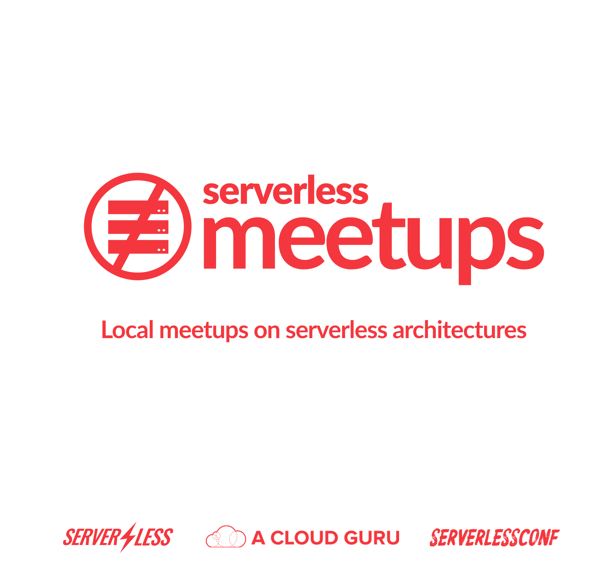

# Serverless Meetups

Local, community-driven meetups on how to build and operate serverless architectures using AWS Lambda, Azure Functions, Google CloudFunctions, IBM OpenWhisk and more!

## Locations

* [San Francisco](http://www.meetup.com/serverless/)
* [Seattle](http://www.meetup.com/Serverless-Seattle/)
* [New York](http://www.meetup.com/Serverless-NYC/)
* [London](http://www.meetup.com/Serverless-London/)
* [Berlin](http://www.meetup.com/Serverless-Berlin/)
* [Melbourne](http://www.meetup.com/Melbourne-Serverless-Meetup-Group/)
* [Sydney](http://www.meetup.com/Sydney-Serverless-Meetup-Group/)
* [Bangkok](http://www.meetup.com/Serverless-Bangkok/)
* [Paris](https://www.meetup.com/fr-FR/Paris-Serverless-Architecture-Meetup/)

## Structure

## Sponsorship

## Sponsors
* [ServerlessConf](http://serverlessconf.io/)
* [Serverless](http://serverless.com)
* [A Cloud Guru](https://acloud.guru/)

